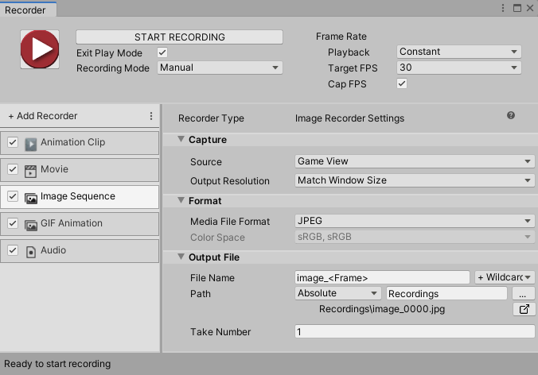

# Image Sequence Recorder properties

The **Image Sequence Recorder** generates a sequence of image files in the JPEG, PNG, or EXR (OpenEXR) file format.

This page covers all properties specific to the Image Sequence Recorder type.

> **Note:** To fully configure any Recorder, you must also set the general recording properties according to the recording interface you are using: the [Recorder window](RecorderWindowRecordingProperties.md) or a [Recorder Clip](RecordingTimelineTrack.md#recorder-clip-properties).

The Image Sequence Recorder properties fall into three main categories:
* [Capture](#capture)
* [Format](#format)
* [Output File](#output-file)

## Capture

Use this section to define the source and the content of your recording.

|Property||Function|
|:---|:---|:---|
| **Source** ||Specifies the input for the recording.|
|| Game View |Records frames rendered in the Game View.  Selecting this option displays the [Game View capture properties](#game-view). |
|| Targeted Camera |Records frames captured by a specific camera, even if the Game View does not use that camera.  Selecting this option displays the [Targeted Camera capture properties](#targeted-camera).|
|| 360 View |Records a 360-degree image sequence.  Selecting this option displays the [360 View capture properties](#360-view).|
|| Render Texture Asset |Records frames rendered in a Render Texture.  Selecting this option displays the [Render Texture Asset capture properties](#render-texture-asset).|
|| Texture Sampling |Supersamples the source camera during the capture to generate anti-aliased images in the recording.  Selecting this option displays the [Texture Sampling capture properties](#texture-sampling).|
| **Flip Vertical** ||When you enable this option, the Recorder flips the output image vertically. This is useful to correct for systems that output video upside down.  This option is not available when you record the Game View.|

### Game View
[!include]

### Targeted Camera
[!include]

### 360 View
[!include]

### Render Texture Asset
[!include]

### Texture Sampling
[!include]

## Format

Use this section to set up the media format you need to save the recorded images in.

|Property||Function|
|:---|:---|:---|
| **Media File Format** || The file encoding format.  Choose **PNG**, **JPEG**, or **EXR** ([OpenEXR](https://en.wikipedia.org/wiki/OpenEXR)). The Recorder encodes EXR in 16 bits. |
| **Color Space** | | The color space (gamma curve and gamut) to use in the output images. |
|  | sRGB, sRGB | Uses sRGB gamma curve and sRGB primaries. |
|  | Linear, sRGB (unclamped) | Uses linear color space with sRGB primaries. This option is only available when you set the **Format** to **EXR**.  **Important:** To get the expected unclamped values in the output images, you must:  • Disable any Tonemapping post-processing effects in your Scene (menu: **Edit > Project Settings > HDRP Default Settings** and deselect **Tonemapping**) and in any Volume that includes a Tonemapping override (select the Volume, navigate in the Inspector and deselect **Tonemapping** if present).  • Disable **Dithering** on the Camera selected for the capture (in the Inspector, navigate to **General** and deselect **Dithering**). |
| **Include Alpha** || Enable this property to include the alpha channel in the recording. Disable it to only record the RGB channels.  This property is not available when the selected **Media File Format** doesn't support transparency, or when **Capture** is set to **Game View**. |

## Output File

Use this section to specify the output **Path** and **File Name** pattern to save the recorded animation clip.

> **Note:** [Output File properties](OutputFileProperties.md) work the same for all types of recorders.
